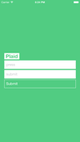

# react-native-plaid

  

This is a React Native app built with a Flux architecture and the Plaid API. This is essentially a boilerplate app that demonstrates the Flux architecture while making http request. Not only it gives a starting point in building an app with Plaid.

##[react-native](https://github.com/facebook/react-native) | [Flux](https://github.com/facebook/flux) | [Plaid](https://github.com/plaid)

##Future Ideas:
* Make the NavBar seperator white (so annoying)
* Build out the mfa questions and work more with the Plaid sandbox.
* Stylize

------------------------
### Have an improvement?
Submit a PR
